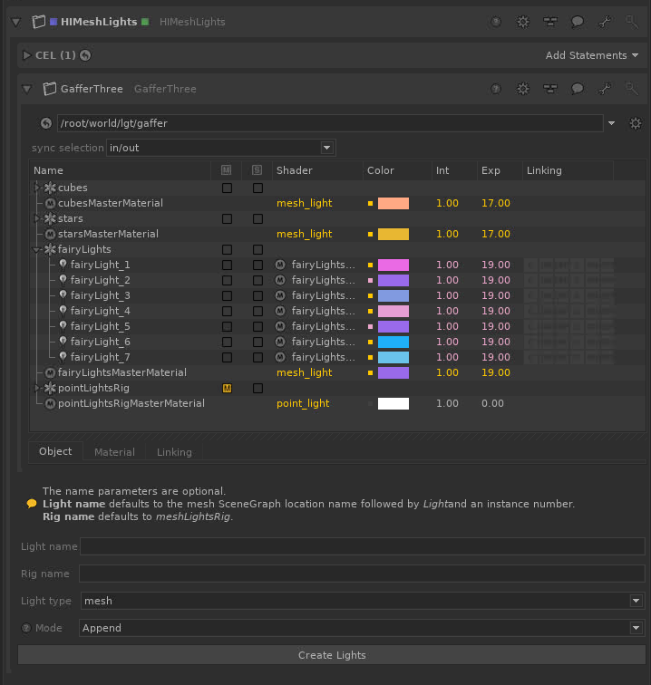
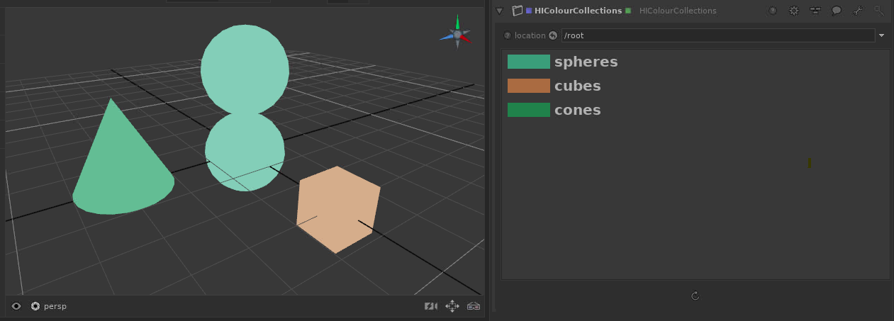
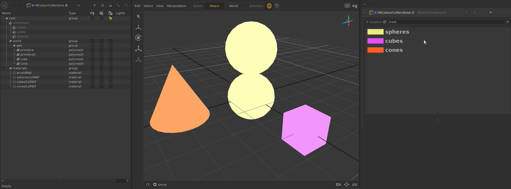

# hikatana
Tools for the Foundry's Katana

### Requirements ###
Katana 3.1v1 or above.

### How to Install ###
#### Linux ####
1. git clone https://github.com/ireneher/hikatana.git
2. cd hikatana
3. source setup.sh

This method works per session. If desired, modify ~/.bashrc to permanently append to path.

## Tools ##
### HIMeshLights ###
SuperTool to create one light per collected mesh (according to input CEL). The user can choose between creating mesh lights or point lights placed at the center of each mesh's bounding box. Each Light Rig is driven by a Master Material, so all lights can be modified at once, but also accept local overrides.

For the set-up above,  with only HIMeshLights providing all the lights in the scene, this is the result: 

[Model Credit](https://sketchfab.com/3d-models/fairy-lights-6167832a8ea04d0bb637315b45fb2d72 )

### HIColourCollections ###
SuperTool to paint the components of a collection in the viewer, inspired by [Gaffer](https://www.gafferhq.org/)'s SetVisualiser node. 

It dynamically updates whenever a change (renaming, content modification, deletion...) to the collections under the input root occurs. A Refresh button is still available should it be needed. The colour assigned to each collection is random, so the user can choose to modify it. The same context menu features the option to Select in SceneGraph, to quickly identify the contents of the collection. 

It does not override any previous material assignments! 

Known limitation: currently it doesn't support multiple membership. Meaning if a mesh belongs to more than one collection, it will only display one of the associated colours.
 
